<p align="center">
  
</p>

<h1 align="center">⚡ ZarchBlack Linux Distribution ⚡</h1>

<p align="center">
  <strong>A Premium, Powerful Arch-Based Operating System for Developers, Hackers & System Administrators</strong>
</p>

<p align="center">
  <a href="https://huggingface.co/datasets/zarchblack/zarchblack-releases/tree/main"></a>
  <a href="https://github.com/ZarchBlack"></a>
  <a href="https://discord.gg/YgVtrsCx"></a>
  <a href="https://t.me/zarchblack"></a>
</p>

<p align="center">
  
</p>

---

## 📋 Table of Contents

- [About ZarchBlack](#about-zarchblack)
- [The Story of Developer Zero7x](#-the-story-of-developer-zero7x)
- [Key Features](#-key-features)
- [Core Custom Utilities](#-core-custom-utilities)
- [System Requirements](#-system-requirements)
- [Releases & Versioning](#-releases--versioning)
- [Installation Guide](#-installation-guide)
- [Quick Start Checklist](#-quick-start-checklist)
- [Getting Help & Community](#-getting-help--community)
- [Contributing](#-contributing)
- [License & Acknowledgments](#-license--acknowledgments)

---

## 🎯 About ZarchBlack

**ZarchBlack** is a state-of-the-art Linux distribution built on the rolling-release foundation of **Arch Linux**, meticulously engineered for:

- 🧑‍💻 **Software Developers** - Out-of-the-box development configurations.
- 💻 **Programmers** - Extensive compilers, runtimes, and IDEs pre-installed.
- 🔐 **Cybersecurity Specialists** - Hardened security baseline and sandbox controls.
- 🎯 **Ethical Hackers** - Direct integration with advanced penetration testing frameworks.
- ⚙️ **System Administrators** - Advanced diagnostics and automation tools.
- 🚀 **Advanced Linux Users** - Full control and customized visual enhancements.

ZarchBlack brings together the power of Arch Linux, the optimizations of the **Cachyos** repository, and the security ecosystem of **BlackArch**, unified under a custom-configured, highly responsive **KDE Plasma 6** environment running on **Wayland** (released in 2026).

---

## 🇲🇦 The Story of Developer Zero7x

ZarchBlack is not just another Arch Linux respin; it is a labor of love, dedication, and passion built entirely by **Zero7x**, a self-taught Moroccan developer. 

Zero7x did not formally study computer science, programming, or software engineering. His skills are the result of pure curiosity, self-learning, and an intense passion for open-source systems. Driven by this hobby, he spent months of long days and sleepless nights resolving compilation errors, tweaking configs, testing system configurations, and repeatedly rebuilding the ISO to deliver a powerful, beautiful, and secure operating system.

By gathering ideas from the most popular Linux distributions, Zero7x combined their best qualities into ZarchBlack. To ensure a premium out-of-the-box experience, he spent a significant amount of time curating a massive, high-definition wallpaper collection and designing custom themes and icons. This level of aesthetic refinement has never been seen before in a newly born 2026 distribution.

Furthermore, unlike many distributions that are only tested in virtual environments, ZarchBlack was rigorously tested and optimized on **physical hardware and bare-metal drives** to ensure absolute stability, speed, and hardware compatibility.

Zero7x believes ZarchBlack has a promising future, and he warmly invites anyone who wants to help develop, test, or contribute to join him on this journey.

---

## ✨ Key Features

### 🚀 Performance & Bare-Metal Stability
- **Rolling-Release Foundation:** Powered by Arch Linux, ensuring you always have the latest packages.
- **Cachyos Optimizations:** Built-in integration with Cachyos repositories for optimized CPU schedulers and performance-tuned kernels.
- **Rigorous Bare-Metal Testing:** Tested directly on real devices and storage drives for guaranteed stability.

### 🎨 State-of-the-Art Aesthetics
- **KDE Plasma 6 on Wayland:** A smooth, modern, and fluid desktop environment running on native Wayland (with X11 fallback).
- **Curated Visual System:** Stunning dark mode aesthetics using the **Darkly** theme, **Layan** window decorations, **Catppuccin Mocha Lavender** color schemes, and beautiful custom icons.
- **Massive Wallpaper Library:** A vast selection of beautiful, high-quality wallpapers to suit any aesthetic preference.

### 🔒 Hardened Security & Repositories
- **BlackArch Integration:** Ready-to-use access to over 2,000+ security and forensic tools.
- **Security Defaults:** Pre-configured firewalls (`ufw`, `firewalld`) and secure sandbox isolation (`firejail`) for sensitive applications.
- **Isolated Testing:** Build and test tools in secure, isolated sandboxes.

---

## 🛠️ Core Custom Utilities

ZarchBlack stands out with three core custom-built programs developed specifically to simplify package management, maintenance, and security:

### 🥷 **ZarchHacking** - Security & Penetration Testing Suite
An advanced dashboard designed for ethical hackers, security researchers, and students to access and classify penetration testing tools.

<p align="center">
  
</p>

* **BlackArch Integration:** Easily install and run tools from the BlackArch catalog.
* **Classified Categories:** Instantly find what you need through logical categories (Reconnaissance, Scanning, Exploitation, Wireless, Forensics, Reverse Engineering, etc.).
* **Safe Sandboxing:** Test security utilities in isolated sandboxes to protect your host OS.

**Usage:**
```bash
zarch-hacking
```

---

### 🛡️ **ZarchGuard** - System Maintenance & Health Manager
A complete system diagnostic and maintenance dashboard to optimize your system and clean resources.

<p align="center">
  
</p>
<p align="center">
  
</p>

* **Rolling System Updates:** Safely check, sync, and update pacman and AUR packages.
* **Deep Clean Engine:** Remove orphan packages, clean package cache (`/var/cache/pacman/pkg`), delete temp files, and clear broken configurations.
* **Self-Healing Tools:** Auto-resolve dependency conflicts, repair broken packages, and run diagnostics to fix theme or system issues.

**Usage:**
```bash
zarch-guard
```

---

### 📦 **ZPackageManager** - Advanced Package & Repo Manager
A powerful package management interface that simplifies installing software and configuring repositories.

<p align="center">
  
</p>
<p align="center">
  
</p>
<p align="center">
  
</p>
<p align="center">
  
</p>
<p align="center">
  
</p>
<p align="center">
  
</p>

* **Flexible Install/Remove:** Smoothly search, install, and uninstall packages.
* **Advanced Repo Configuration:** Easily manage official repositories, Cachyos, BlackArch, and custom user repositories.
* **Dependency Tree Analysis:** Inspect and visualize dependency packages to avoid conflicts.

**Usage:**
```bash
zpackagemanager
```

---

## 💻 System Requirements

| Component | Minimum | Recommended |
|-----------|---------|-------------|
| **CPU** | 2.0 GHz dual-core (64-bit) | 3.0 GHz quad-core or higher |
| **RAM** | 4 GB | 8 GB or more |
| **Disk Space** | 30 GB | 100 GB or more |
| **Display** | 1366x768 | 1920x1080 or higher |
| **Graphics** | Basic graphics support | Dedicated GPU (NVIDIA/AMD/Intel) |
| **Connection** | Broadband | High-speed internet |

---

## 📦 Releases & Versioning

### **ZarchBlack v1.0 (Official Stable)**
<p align="center">
  
</p>

| Information | Details |
|------------|---------|
| **Version** | 1.0 |
| **Release Date** | May 30, 2026 |
| **Status** | Stable (Rolling Release) |
| **Download Mirror** | [Hugging Face Releases](https://huggingface.co/datasets/zarchblack/zarchblack-releases/tree/main) |

#### Features included in v1.0:
- **Base System:** Solid Arch Linux foundation with the Cachyos repository enabled.
- **Core Apps:** Initial releases of `zarch-hacking`, `zarchguard`, and `zpackagemanager`.
- **Desktop Environment:** Highly customized KDE Plasma 6 desktop running on Wayland.
- **Toolkits:** Full programming stacks for Python, JavaScript, Go, Rust, C/C++ and pre-configured IDEs (VS Code, JetBrains).

---

## 📸 Desktop Gallery

<p align="center">
  
</p>
<p align="center">
  
</p>
<p align="center">
  
</p>
<p align="center">
  
</p>

---

## 🚀 Installation Guide

### Step 1: Download the ISO
Download the official ISO file from the Hugging Face mirror:
```
https://huggingface.co/datasets/zarchblack/zarchblack-releases/tree/main
```

### Step 2: Create a Bootable USB Drive
* **Using Balena Etcher (Cross-platform):** Select the ISO, choose your USB drive, and click "Flash!".
* **Using Rufus (Windows):** Load the ISO, keep default partition settings, and write in ISO Image mode.
* **Using `dd` (Linux/macOS):**
  ```bash
  # Identify your USB drive (e.g., /dev/sdb)
  lsblk
  
  # Unmount the drive
  sudo umount /dev/sdX*
  
  # Flash the ISO
  sudo dd if=ZarchBlack-v1.0.iso of=/dev/sdX bs=4M status=progress conv=fdatasync
  ```

### Step 3: Boot and Install
1. Insert the USB drive and reboot your PC.
2. Press your boot menu key (F12, F11, F8, etc.) and select the UEFI USB drive.
3. Launch the graphical **Calamares** installer from the desktop.
4. Follow the installation wizard (Language, Partitioning, User Account, etc.).
5. Wait for the installation to finish and reboot.

---

## ⚙️ Quick Start Checklist

- [ ] Download the ZarchBlack v1.0 ISO.
- [ ] Flash the ISO to a USB drive and boot.
- [ ] Install using the Calamares graphical installer.
- [ ] Run the initial configuration wizard on first boot.
- [ ] Launch `zarch-hacking` to check out the classified security suites.
- [ ] Run `zarch-guard` to clean temporary files and update repositories.
- [ ] Join the ZarchBlack community!

---

## 🌐 Getting Help & Community

Connect with us and other ZarchBlack users through our community channels:

- **GitHub Discussions:** [Join the conversation](https://github.com/ZarchBlack)
- **Discord Server:** [Discord Invite (Temporary)](https://discord.gg/YgVtrsCx)
- **Telegram Group:** [Telegram Channel (Temporary)](https://t.me/zarchblack)
- **Official Documentation:** [Wiki & Guides (Temporary)](https://github.com/ZarchBlack/ZARCH) 

We welcome developers, security researchers, designers, and writers to help improve ZarchBlack! 

### How to contribute code:
1. Fork the ZarchBlack repository on GitHub.
2. Clone your fork locally:
   ```bash
   git clone https://github.com/YOUR_USERNAME/ZARCH.git
   ```
3. Create your feature branch (`git checkout -b feature/awesome-feature`).
4. Commit your changes with clear descriptions.
5. Push to your branch and create a Pull Request on GitHub.

---

## 📜 License & Acknowledgments

ZarchBlack is distributed under the **GNU General Public License v3.0** (GPLv3). 

We would like to thank the core projects that made ZarchBlack possible:
- **[Arch Linux](https://archlinux.org)** - The rock-solid rolling-release base.
- **[Cachyos](https://cachyos.org)** - Providing performance repositories and kernels.
- **[BlackArch Linux](https://blackarch.org)** - For the extensive cybersecurity tools.
- **The Open Source Community** - For developing the frameworks, icons, and software integrated into this OS.

---
<p align="center">
  <sub>ZarchBlack © 2026 • Built with passion by <strong>Zero7x</strong> • Licensed under GPLv3</sub>
</p>
